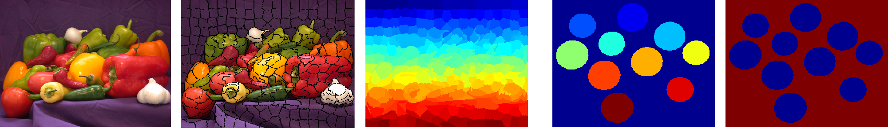

## Superpixel toolbox to manipulate superpixel segmentation on MATLAB

### Overview

- Simple functions to get superpixel borders, adjacency matrix, label map, centers, etc.  
- Metrics evaluating color homogeneity (explained variation, intra-cluster variation), regularity (circularity) and respect of image objects (achievable segmentation accuracy) metrics
- Region filling function to get a label map from contours...




### Execution
```
run main_fct_sp.m
```


### License

(C) Rémi Giraud, 2020  
remi.giraud@u-bordeaux.fr  
[https://remi-giraud.enseirb-matmeca.fr](https://remi-giraud.enseirb-matmeca.fr)  
ENSEIRB-MATMECA (Bordeaux INP), Laboratory IMS

This code is free to use, share and modify for any non-commercial purposes.  
Any commercial use is strictly prohibited without the authors' consent.
```
